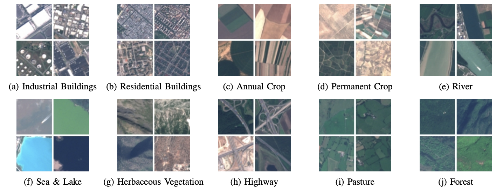
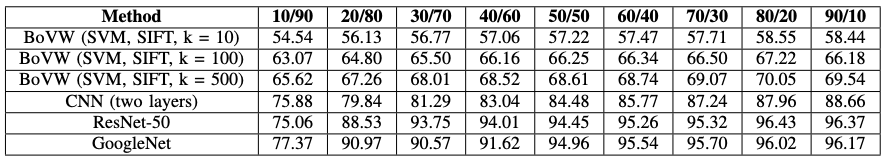
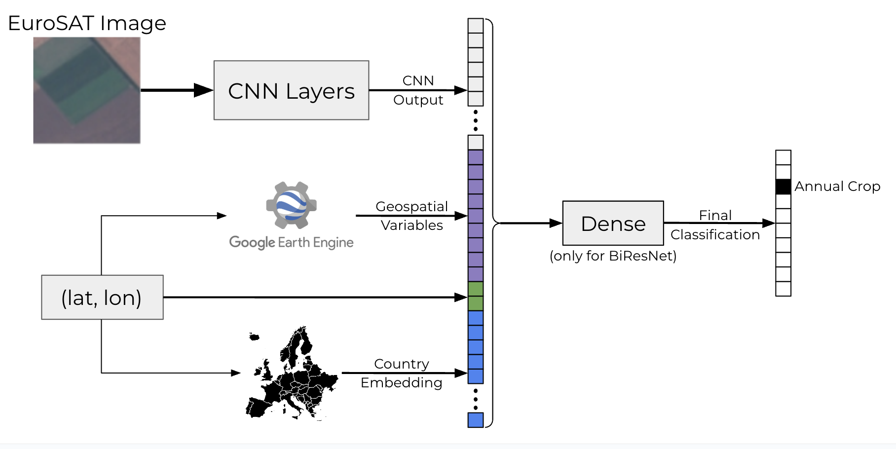
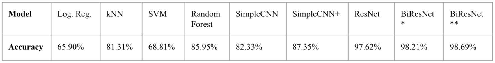
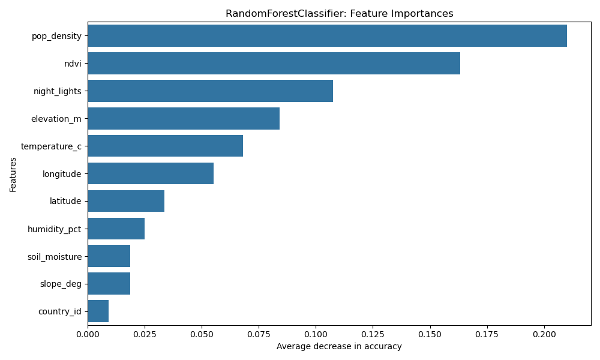
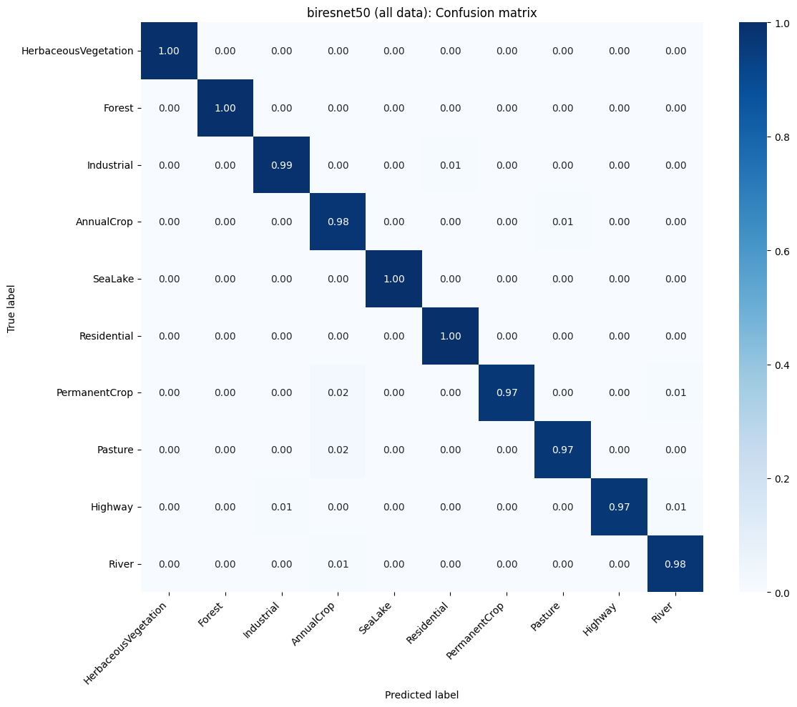

# Enhancing Satellite Image Classification with Non-Image Data

## Introduction
In the evolving landscape of machine learning, models have progressed from handling simple tabular data to processing more complex data types. Feed-forward neural networks (FFNNs) are well-suited for tabular data, convolutional neural networks (CNNs) for images, and recurrent neural networks (RNNs) or transformers for language and other time series data. More recently, researchers have become interested in combining these foundational architectures into multi-modal hybrid models.  
  
In this paper, we investigate whether image classification can be enhanced by integrating structured non-image data into model architectures. Our focus is on satellite image classification, where auxiliary geographic and environmental variables may provide signal beyond what is available in raw pixels. These features can enrich the model’s understanding and lead to improved predictive performance.  
  
We explore this idea using the EuroSAT dataset, which contains 27,000 satellite images categorized into ten land use and land cover classes. Building on benchmark CNN-based models established by Helber et al., we incorporate non-image data into computer vision architectures to create a multi-modal learning framework. The non-image data is collected from Google Earth Engine, which provides various geospatial measurements from satellite sensor technologies.  
  
This paper proposes a general framework for the effective fusion of image and non-image modalities, while also presenting a concrete implementation in the context of Earth observation. Specifically, we investigate how satellite imagery and satellite-derived measurements can be integrated within a unified model architecture to improve land use and land cover classification. By addressing both broader architectural considerations and a targeted application, we aim to contribute insights that are relevant not only for remote sensing tasks but also for the design of multi-modal machine learning systems in general.

## Related Works
Early breakthroughs in computer vision came with convolutional neural networks (CNNs), introduced by LeCun et al. for digit recognition, and later extended to large-scale image classification tasks with AlexNet [1]. Residual networks (ResNets) introduced skip connections, which allow gradients to flow more effectively through the network and preserve features learned in earlier layers [2]. This enabled the successful training of much deeper architectures. The 50-layer variant, ResNet-50, has become widely used in visual recognition tasks due to its strong performance and scalability.  
  
In the field of earth observation machine learning (EO-ML), CNNs have been employed to process satellite imagery and predict variables related to land use, agriculture, and human development. The EuroSAT dataset is one prominent example, enabling classification of land cover types from RGB and multispectral satellite images [3]. Other studies have extended this approach to infer socioeconomic indicators. Yeh et al. used CNNs on satellite imagery to estimate economic development and poverty [4]. Beyond static images, EO-ML has increasingly embraced spatio-temporal modeling. CNNs can be used to extract spatial features from satellite images and feed these outputs into recurrent architectures such as LSTMs to capture changes over time [5].  
  
Outside of EO-ML, computer vision has seen a growing interest in combining image data with non-image modalities, such as tabular or textual features, to enhance prediction. For example, CLIP, a model that jointly trains on image-text pairs to learn visual representations, laid the foundational groundwork for vision-language models capable of zero-shot transfer across downstream tasks [6].  
  
Our work builds on advances in multi-modal learning, focusing specifically on earth observation data. We explore how structured non-image data can be fused into CNN-based architectures to improve land use classification for the EuroSAT dataset.

## Methods
### Data Collection and Preprocessing
#### Image Data
Our primary dataset is EuroSAT, a publicly available collection of 27,000 images taken by the Sentinel-2A satellite [3]. Each is 64×64 pixels, with a ground resolution of up to 10 meters per pixel. Thus, each has a resolution of 640 meters in length and height, or around 0.16 square miles. The images are labeled into one of ten land use and land cover classes: Forest, Annual Crop, Permanent Crop, Pasture, Herbaceous Vegetation, Residential, Industrial, Highway, River, and Sea Lake (see Figure 1). Although the EuroSAT paper does not specify exact acquisition dates of the images they use, the earliest date mentioned is August 2015 (two months after the launch of Sentinel-2A) and the latest is March 2017.  
<figure>
  
  <figcaption><em>Figure 1: Samples of the 10 land cover and land usage labels in EuroSAT. [3]</em></figcaption>
</figure>  
    
  
#### Non-Image Data
To supplement the images with non-image data, we first extracted the latitude and longitude coordinates embedded in the metadata of the EuroSAT multispectral .tif files. Each image’s geographic center was then mapped to a country based on shapefile boundaries.  
  
We then queried environmental and geospatial variables from Google Earth Engine (GEE). Specifically, we retrieved: (1) soil moisture from NASA/SMAP/SPL3SMP_E/006 (9,000 meters/pixel), (2) surface elevation from USGS/SRTMGL1_003 (30 meters/pixel), (3) terrain slope from elevation models, (4) nighttime light intensity from NOAA/VIIRS/DNB (464 meters/pixel), (5) vegetation density (NDVI) from MODIS/061/MOD13A2 (1,000 meters/pixel), (6) surface temperature from MODIS/061/MOD11A2 (1,000 meters/pixel), (7) surface humidity derived from temperature and dewpoint values in ECMWF/ERA5/DAILY (11,132 meters/pixel), and (8) population from WorldPop/GP/100m/pop (93 meters/pixel) [7]. We record measurements at the resolution of the one pixel which contains the coordinate associated with the corresponding EuroSAT image in order to ensure spatial alignment between resolutions. The latitude and longitude were also included among the non-image features.  
  
These geospatial measurements are derived from physical modeling and satellite-based sensor data. Although they can be visualized spatially, their coarse resolution relative to the fine-grained EuroSAT image patches makes it more appropriate to treat them as tabular features. Unlike image data, they do not encode texture or visual patterns but represent aggregated environmental attributes over larger geographic grids.  
  
To maintain temporal alignment across input features, all time-varying non-image variables were averaged over the full year of 2016. This decision aligns with the timeframe of the EuroSAT image acquisitions, which, as mentioned above, likely range from August 2015 to March 2017. Helber et al. sampled satellite images from across the year to capture seasonal variance, further motivating our decision to limit our non-image data to one calendar year.  
  
### EuroSAT Benchmarks
In the original EuroSAT paper, Helber et al. benchmarked several models across different band combinations, weight initializations, and data splits. The models tested included a bag-of-visual-words (BoVW) classifier using SIFT features, a simple 2-layer CNN, GoogleNet, and ResNet-50. For weight initialization, Helber et al. experimented with training models from scratch and fine-tuning from models pre-trained on ILSVRC-2012. They experimented with multiple data splits, with an 80-20 train-test ratio having the best performance. Images were classified using different spectral bands, including color-infrared (CI), short-wave infrared (SWIR), and RGB, the latter of which yielded the highest performance. This benchmark setup informs our own modeling choices, providing a strong and well-understood baseline for evaluating the impact of additional non-image features. See the results from Helber et al. in Table I.  
<figure>
  
  <figcaption><em>Table I: Classification accuracy across different train-test splits from Helber et al. [3]</em></figcaption>
</figure>  
    
  
### Model Architectures
We designed a variety of models to evaluate the incorporation of non-image data to satellite imagery. As a baseline, we first trained traditional machine learning models solely on the non-image features extracted from Google Earth Engine, as well as latitude and longitude coordinates. Logistic regression, k-nearest neighbors (kNN), support vector machines (SVM), and random forests were each evaluated using grid search 5-fold cross-validation to optimize hyperparameters.  
  
For image-based models, we implemented a shallow two-layer CNN, which we call SimpleCNN. This architecture resembles the 2-layer CNN explored in the original EuroSAT paper, though they do not give specifics on the architectural configuration. We trained SimpleCNN both on image data alone and on image data concatenated with non-image features (SimpleCNN+).  
  
We then use the best-performing model from Helber et al., a standard ResNet-50 architecture pre-trained on ImageNet and then fine-tuned solely on image data. To integrate non-image features, we modified the ResNet-50 architecture into a bimodal form, which we call BiResNet. The outputs from the ResNet-50 backbone were concatenated with additional non-image feature vectors.  
  
To represent country information, we used an embedding layer of dimension 16. The remaining non-image geospatial features were concatenated into a 10-dimensional vector for integration into the network. We also implemented a dense layer after concatenation with 128 nodes. In sum, a non-image feature vector of length 26 (10 variables + 16 dimension country embedding) were concatenated to the ResNet output before the final classification layer for the joint image/non-image models. This BiResNet architecture is displayed in Figure 2.  
<figure>
  
  <figcaption><em>Figure 2: The BiResNet architecture, which concatenates the image and non-image data, before passing them through a dense layer and then the output layer.</em></figcaption>
</figure>  
    
  
## Results
Table II summarizes the test set accuracies achieved by each model across different data modalities and architectural variants. 70% of the images were used for training, and the remaining 30% evenly split for validation and testing. Each deep learning model was trained three times, and the reported results reflect the average test set accuracy.  
<figure>
  
  <figcaption><em>Table II: Test accuracies. BiResNet with (**) and without (*) a post-concatenation dense layer.</em></figcaption>
</figure>  
    

Traditional machine learning models trained solely on non-image data performed relatively well. The random forest was the best among them, with an accuracy of 85.95%, followed by k-nearest neighbors (81.31%), support vector machines (68.81%), and logistic regression (65.90%). The feature importances are displayed in Figure 3. Each value is the average decrease in test accuracy after permuting the given feature 30 times. Population density and NDVI were the most important (>20 and >16 percentage point decrease, respectively), and the country encoding was the least significant (>1 percentage point).  
<figure>
  
  <figcaption><em>Figure 3: Feature importances for the random forest model.</em></figcaption>
</figure>  
    

The shallow CNN (SimpleCNN) model achieved 82.17% accuracy when trained on images alone–which is slightly worse than the random forest–but this increased to 87.48% when non-image data was incorporated (SimpleCNN+). ResNet-50, trained only on the EuroSAT images, achieved a strong baseline test accuracy of 97.62%, closely matching the results reported by Helber et al.  
  
The major contribution of the paper is the new best-performing model, BiResNet, which incorporates non-image data into a ResNet-50 backbone. This model does so by concatenating the 8 geospatial variables from Earth Engine, longitude, latitude, and the country embedding to the ResNet output. BiResNet achieved a test accuracy of 98.21% without the post-concatenation dense layer. When a dense layer of 128 nodes was added after concatenation, performance improved further to 98.69%, suggesting that non-linear mixing of image and non-image features enhances signal extraction (see Figure 4).  
  
Overall, these results demonstrate that while satellite images alone provide strong predictive signals for land use classification, integrating structured environmental and geospatial features leads to consistent and meaningful performance gains across architectures.  
<figure>
  
  <figcaption><em>Figure 4: Confusion matrix of the new best-performing BiResNet model (98.75% accuracy).</em></figcaption>
</figure>  
    
  
## Discussion
This study introduces a new best-performing model for the EuroSAT image classification task: BiResNet, a ResNet-50 architecture enhanced with structured non-image features. By fusing satellite imagery with geospatial variables retrieved from Google Earth Engine, BiResNet achieved a test accuracy of 98.69%.  
  
The non-image data likely include a combination of complementary and redundant information. On one hand, the geospatial variables will provide environmental or socioeconomic context that is not present in raw RGB pixel values, offering orthogonal signal to what the CNN can extract. On the other hand, some may encode patterns that a CNN could, in theory, infer from visual texture or color gradients. However, explicitly supplying these structured measurements still allows the model to bypass the need to learn them from scratch, freeing up representational capacity to focus on other complementary features. In this way, the non-image data serves both as an information booster and as a regularizer, helping the model converge faster and generalize better by reducing reliance on noisy visual proxies.  
  
The additional input does not impose a strong constraint on model deployment. Google Earth Engine provides global coverage for the variables used in this study, enabling inference in new locations without requiring inaccessible or incomplete data sources. Because the non-image variables can be retrieved in a reliable manner, this approach remains practical and generalizable across diverse geographic regions.  
  
A key challenge addressed in this work was ensuring alignment between the image and non-image data. Spatially, the non-image geospatial measurements contained the geographic area of the satellite image. Temporally, the non-image variables were averaged over 2016 to correspond with the EuroSAT image acquisition period.  
  
Future work could extend this framework by incorporating additional Earth Engine features or alternative metadata sources, testing generalization to other datasets and continents, exploring more advanced fusion techniques such as cross-attention, and leveraging sequential models to process time series of images and measurements over time.  

## References
1. A. Krizhevsky, I. Sutskever, and G. E. Hinton. Imagenet classification with deep convolutional neural networks. In Advances in neural information processing systems, pages 1097–1105, 2012.
2. K. He, X. Zhang, S. Ren, and J. Sun. Deep residual learning for image recognition. In Proceedings of the IEEE Conference on Computer Vision and Pattern Recognition, pages 770–778, 2016.
3. P. Helber, B. Bischke, A. Dengel and D. Borth. EuroSAT: A novel dataset and deep learning benchmark for land use and land cover classification. In IEEE Journal of Selected Topics in Applied Earth Observations and Remote Sensing, vol. 12, no. 7, pages 2217-2226, 2019.
4. Christopher Yeh, Anthony Perez, Anne Driscoll, George Azzari, Zhongyi Tang, David Lobell, Stefano Ermon, and Marshall Burke. Using publicly available satellite imagery and deep learning to understand economic well-being in africa. In Nature Communications, 2020.
5. M. Pettersson, M. Kakooei, J. Ortheden, F. Johansson, and A. Daoud. Time series of satellite imagery improve deep learning estimates of neighborhood-level poverty in africa. In Proceedings of the Thirty-Second International Joint Conference on Artificial Intelligence (IJCAI-23) Special Track on AI for Good, pages 6165-6173, 2023.
6. Alec Radford, Jong Wook Kim, Chris Hallacy, Aditya Ramesh, Gabriel Goh, Sandhini Agarwal, Girish Sastry, Amanda Askell, Pamela Mishkin, Jack Clark, et al. Learning transferable visual models from natural language supervision. In International conference on machine learning, pp. 8748–8763. PMLR, 2021.
7. N. Gorelick, M. Hancher, M. Dixon, S. Ilyushchenko, D. Thau, and R. Moore. Google earth engine: planetary-scale geospatial analysis for everyone. In Remote Sensing of Environment, 202, 18–27, 2017.

